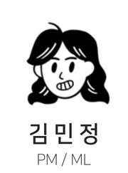
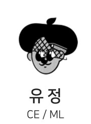
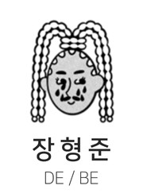

# AI Life & Food Advisor

## 📌 프로젝트 계획서

### 1. 프로젝트 개요

* **프로젝트명**: AI Life & Food Advisor
* **목표**: 감정·식단 데이터를 통합하여 수집한 뒤, 사용자에 대한 일일/주간 리포트와 행동 추천 및 메뉴 추천을 제공
* **기간**: 2025년 11월 \~ 2026년 1월

### 2. 프로젝트 일정

* **기획 및 설계**: 11월 중순
* **데이터 모델링**: 11월 말 \~ 12월 초
* **모델 개발(ML/LLM)**: 12월 초 \~ 12월 중순
* **UI/UX 구현 및 테스트/배포**: 12월 중순 \~ 1월 초
* **최종 발표 및 보고서 작성**: 1월 초 \~ 1월 9일

## 😎 팀원 소개
<table style="width:100%; text-align:center; table-layout:fixed; border-collapse:collapse;">
  <colgroup>
    <!-- 전체 5열이므로 20%씩 -->
    <col style="width:20%;">
    <col style="width:20%;">
    <col style="width:20%;">
    <col style="width:20%;">
  </colgroup>
  <thead>
    <tr>
      <th>김민정</th>
      <th>김남기</th>
      <th>유 정</th>
      <th>장형준</th>
    </tr>
  </thead>
  <tbody>
    <tr>
      <td></td>
      <td></td>
      <td></td>
      <td></td>
    </tr>
    <tr>
      <td>PM ML LLM Front/Back</td>
      <td>ML Front/Back AWS</td>
      <td>ML Front/Back AWS</td>
      <td>ML Front/Back RDS</td>
    </tr>
    <!-- <tr>
      <td></td>
      <td></td>
      <td></td>
      <td></td>
      <td></td>
    </tr> -->
  </tbody>
</table>
 

---

## 📄 요구사항 정의서